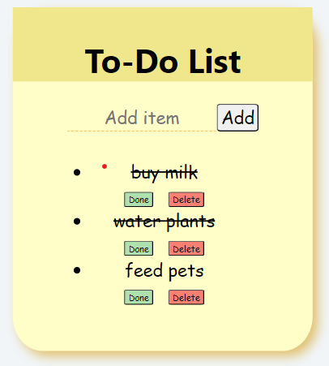

Project Name : <b>To Do App</b>

Description : This is a To Do List App, where you can add any task to do , strike it off when its done and later delete it from the list. 

Technology used : React JS

How to run the code:
<ol>
  <li>Initialise the npm package by using the statement 
    
### `npm init -y`

</li>
  <li>Install the packages in package.json by using the statement </li>

### `npm i`
  <li>In the project directory, you can run </li>

### `npm start`

</ol>

Result :  You will be redirected to "http://localhost:3000/"
 

